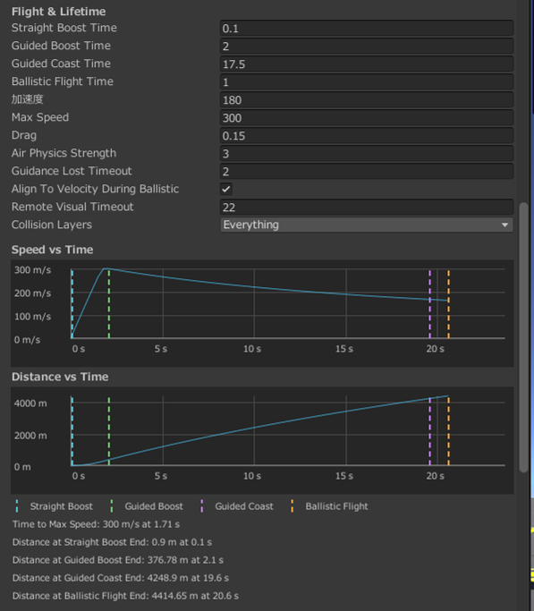
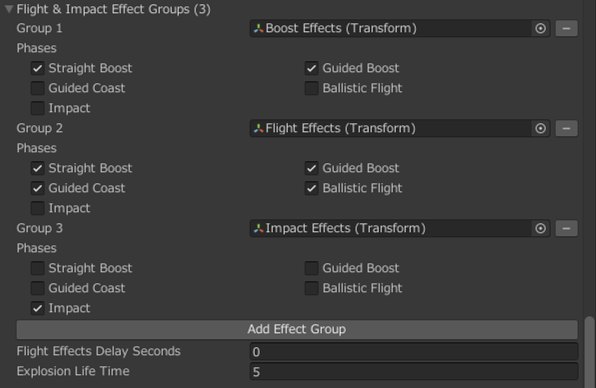

# 基本的な設定

## 飛翔特性の設定

### `FSE_MissileController`

- `StraightBoostTime`、`GuidedBoostTime`、`GuidedCoastTime`、`BallisticFlightTime`で、4つの飛翔フェーズの継続時間をそれぞれ秒単位で設定します。各フェーズの概要については[飛翔フェーズ](behavior.md#phases)を参照してください。
- `Acceleration`で発射後の加速度を設定できます。`MaxSpeed`で最高速度を制限します。
- `Drag`で速度の二乗に比例する抵抗を設定できます。全飛翔フェーズで作用します。
- 初速を0 m/sとしたときの各フェーズでのミサイルの速度と飛距離をグラフで確認することができます。

{ width="900" loading=lazy }

- Flight Instabilityを有効にすると、動力飛翔中に滑らかな上下左右の揺らぎを加えます。
- `RollVisualRoot`を設定すると、物理挙動を変えずに見た目だけをロールできます。

## 飛翔・着弾エフェクトの設定

### `FSE_DFUNC_MissileLauncher`

- 発射時に再生するエフェクト、またはエフェクトを子に持つオブジェクトを`Launch Effects Root`へ指定します。親自身にも配置できます。
- 配布Prefabでは設定済みです。旧`Launch Sound`／`Launch Particle`を使用した独自Prefabは、エフェクトをまとめた親オブジェクトを`Launch Effects Root`へ指定し直します。

### `FSE_MissileController`

- 飛翔中と起爆時に再生するエフェクトを`Flight & Impact Effect Groups`に設定します。
- `Add Effect Group`をクリックし、エフェクト（パーティクル・トレイル・音源）、またはエフェクトを子に持つオブジェクトを`Group`へ指定します。
- 各`Group`ごとにエフェクトを再生するタイミングにチェックを入れます。

{ width="900" loading=lazy }

## 誘導方式固有の設定

### MCLOS誘導の設定

#### `FSE_MCLOSInputController`

- `InputDeadZone`はVRスティックの中央付近だけに適用されます。
- `InvertPitch`と`InvertYaw`で操作方向を軸ごとに反転できます。
- `SyncInterval`は操作状態を送る間隔です。

#### `FSE_MCLOS Guidance`

- `MaxPitchRate`、`MaxYawRate`は、上下・左右の旋回能力を決めます。
- `MaxLateralAcceleration`は、上下・左右を合わせた旋回にかけられる横加速度の上限です。

### SACLOS誘導の設定

#### `FSE_SACLOSGuidance`

- `GuidanceLookAhead`は照準線上で操舵が目指す距離です。
- `MinimumCommandDistance`は近距離で操舵目標がミサイルへ近づきすぎることを防ぎます。
- `MaxGuidanceAngle`は誘導指令を受け付ける角度範囲です。
- `MaxTurnRate`と`MaxLateralAcceleration`は旋回能力を制限します。過大な値は不自然な急旋回につながります。
