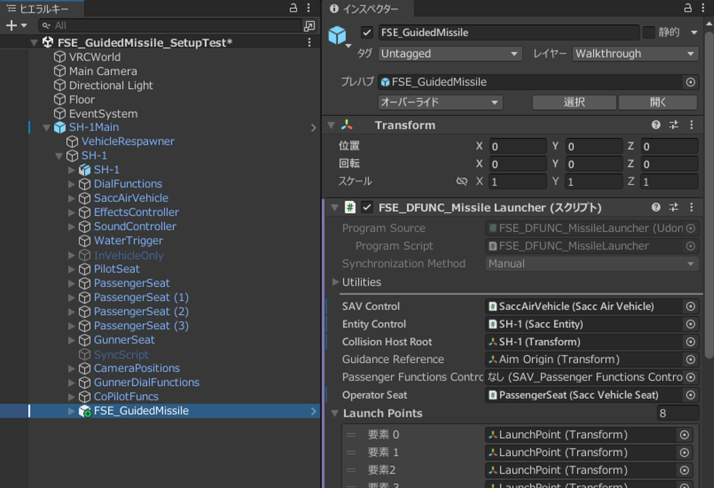
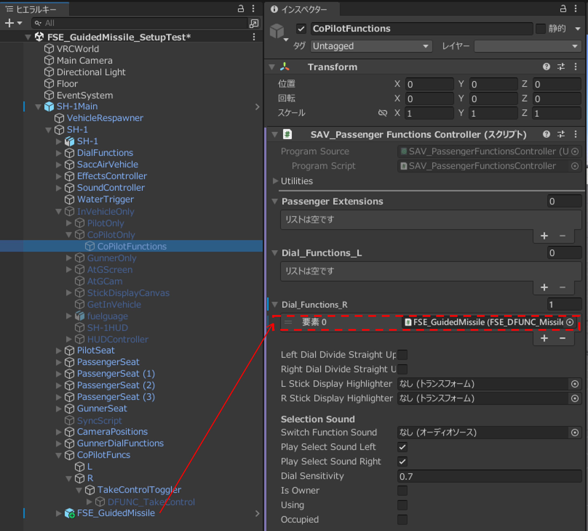
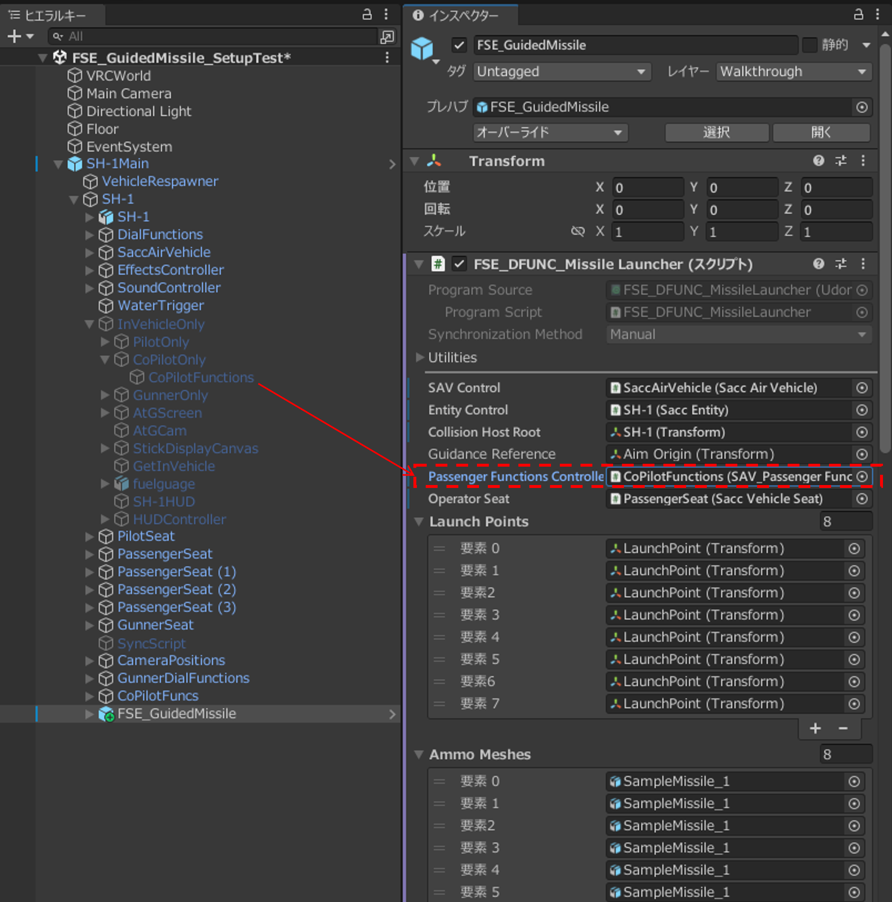
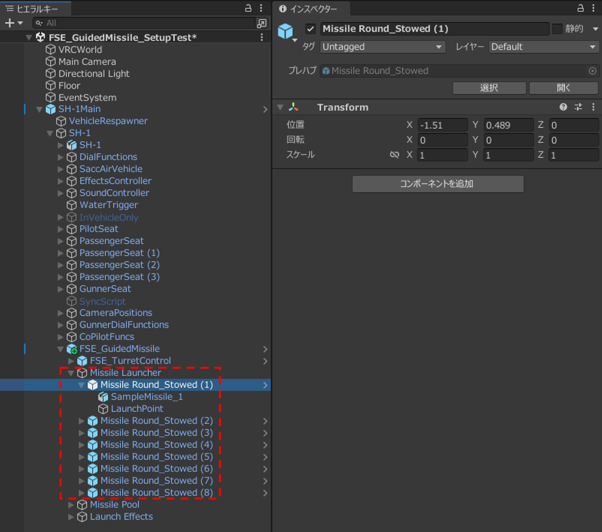

# 共通セットアップ

以下は各誘導方式に共通する手順です。共通セットアップの後に各誘導方式固有の設定を行います。

## 1. 乗り物の事前準備

Guided Missileをセットアップする対象の乗り物にSaccをセットアップし、正常に動作することを確認します。このページではセットアップ済みの乗り物として、SaccのSH-1を使用します。

## 2. FSE_GuidedMissileを配置する

`Assets/Furunin/SaccExtensions/Prefabs/Guided Missile/SubComponents/FSE_GuidedMissile`を乗り物の`Sacc Entity`の下へ配置します。

`FSE_GuidedMissile`オブジェクトの`FSE_DFUNC_MissileLauncher`に以下の設定をします。

- `SAVControl`：乗り物の`Sacc Air Vehicle`コンポーネント
- `EntityControl`：乗り物の`SaccEntity`コンポーネント
- `CollisionHostRoot`：発射直後の衝突判定から除外するオブジェクト
- `OperatorSeat`：ミサイルの発射・誘導を行う操作席のオブジェクト

{ width="900" loading=lazy }

## 3. 操作席の設定をする

### PassengerSeatで操作する場合

1. PassengerSeatの`Sacc Vehicle Seat`内`Passenger Functions`が参照する`SAV_PassengerFunctionsController`をクリックし、ヒエラルキー上の場所を確認します。

    !!! Note "Passenger Functionsが未設定の座席を使用する場合"

        乗り物内のGameObjectへ`SAV_PassengerFunctionsController`を追加し、そのComponentを対象の`PassengerSeat`にある`Sacc Vehicle Seat`の`Passenger Functions`へ指定してください。以降の手順では、ここで指定したControllerを使用します。

2. `SAV_PassengerFunctionsController`の`Dial_Functions_L`または`Dial_Functions_R`に`FSE_GuidedMissile`オブジェクト（`FSE_DFUNC_MissileLauncher`）を登録します。

    { width="900" loading=lazy }

    !!! Info  "`FSE_GuidedMissile`と`DFUNC_TakeControl`の共存について"
        ミサイルの誘導機能は指定した座席から移動させられないため、`DFUNC_TakeControl`で座席機能を交代しても交代先の座席でミサイルの誘導をすることができません。このセットアップ手順では`DFUNC_TakeControl`を削除しています。`DFUNC_TakeControl`を削除せずに共存させ、ミサイル誘導機能を設定した座席で交代先の機能を使用することは可能です。

3. `SAV_PassengerFunctionsController`を`FSE_GuidedMissile`の`FSE_DFUNC_MissileLauncher`内`PassengerFunctionsController`へ登録します。

    { width="900" loading=lazy }

### PilotSeatで操作する場合

PilotSeatでミサイルを選択している間は、機体操作と照準操作が重ならないように機体操作が抑止されます。

1. `PassengerFunctionsController`は未設定にします。
2. `FSE_DFUNC_MissileLauncher`を、セットアップ対象の乗り物の`SaccEntity`の`Dial_Functions_L`または`Dial_Functions_R`に登録します。

## 4. ミサイルの発射位置と搭載弾表示を調整する

`Missile Launcher`以下の`Missile Round_Stowed`の位置と回転を調整します。`Launch Point`のZ軸+（青い矢印）方向が発射方向を向くようにします。メッシュを差し替えることで任意の3Dモデルを使用することができます。

{ width="900" loading=lazy }

## 5. 照準器を乗り物へ接続する

- 誘導方式にSACLOS以外を使用する場合は、この手順は任意です。
- 誘導方式にSACLOSを使用する場合は、誘導の基準となるオブジェクトを指定する必要があります。可動する照準器（砲塔）に基準オブジェクトを配置することでミサイルを任意方向に誘導できますが、固定のオブジェクトを利用することも可能です。砲塔を使用する場合、`FSE_GuidedMissile`プレハブに付属している`FSE_TurretControl`を利用することができます（[セットアップ手順](../turret-control/installation.md)）。

## 6. 誘導方式別の導入をする

- [MCLOSを導入する](mclos.md)
- [SACLOSを導入する](saclos.md)

## 7. 爆発時のメッシュ非表示設定をする

追加したミサイルや照準器などのメッシュが爆発時に消滅するように設定します。

1. 爆発時のアニメーションを開きます。既存のアニメーションを利用する場合は、複製してからアニメーションコントローラー内で参照されるように設定し、2.の手順に進みます。

    !!! Info  "爆発アニメーションの場所"
        例として、SaccのSH-1の場合は`Assets/SaccFlightAndVehicles/AssetFiles/SH-1/Animations/Explode_SH1`にあります。

2. 爆発時に非表示にしたいオブジェクト（ミサイルランチャー、照準器、格納中ミサイルなど）を追加し、チェックを外して表示されないようにします。

## 8. 任意機能を導入する

[任意機能の導入](optional-features.md)を参照してください。
