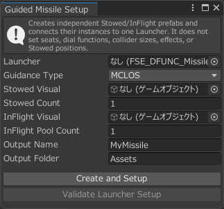

# 導入手順

以下は各誘導方式に共通する手順です。共通セットアップの後に各誘導方式固有の設定を行います。

## 1. 乗り物の事前準備

Guided Missileをセットアップする対象の乗り物にSaccをセットアップし、正常に動作することを確認します。このページではセットアップ済みの乗り物として、SaccのSH-1を使用します。

## 2. FSE_GuidedMissileを配置する

`Assets/Furunin/SaccExtensions/Prefabs/Guided Missile/SubComponents/FSE_GuidedMissile`を乗り物の`Sacc Entity`の下へ配置します。

`FSE_GuidedMissile`オブジェクトの`FSE_DFUNC_MissileLauncher`に以下の設定をします。

- `SAVControl`：乗り物の`Sacc Air Vehicle`コンポーネント
- `EntityControl`：乗り物の`SaccEntity`コンポーネント
- `CollisionHostRoot`：発射直後の衝突判定から除外するオブジェクト
- `OperatorSeat`：ミサイルの発射・誘導を行う操作席のオブジェクト

{ width="900" loading=lazy }

## 3. 操作席の設定をする

### 3-A. PassengerSeatで操作する場合

1. PassengerSeatの`Sacc Vehicle Seat`内`Passenger Functions`が参照する`SAV_PassengerFunctionsController`をクリックし、ヒエラルキー上の場所を確認します。

    !!! Note "Passenger Functionsが未設定の座席を使用する場合"

        乗り物内のGameObjectへ`SAV_PassengerFunctionsController`を追加し、そのComponentを対象の`PassengerSeat`にある`Sacc Vehicle Seat`の`Passenger Functions`へ指定してください。以降の手順では、ここで指定したControllerを使用します。

2. `SAV_PassengerFunctionsController`の`Dial_Functions_L`または`Dial_Functions_R`に`FSE_GuidedMissile`オブジェクト（`FSE_DFUNC_MissileLauncher`）を登録します。

    { width="900" loading=lazy }

    !!! Info  "`FSE_GuidedMissile`と`DFUNC_TakeControl`の共存について"
        ミサイルの誘導機能は指定した座席から移動させられないため、`DFUNC_TakeControl`で座席機能を交代しても交代先の座席でミサイルの誘導をすることができません。このセットアップ手順では`DFUNC_TakeControl`を削除しています。`DFUNC_TakeControl`を削除せずに共存させ、ミサイル誘導機能を設定した座席で交代先の機能を使用することは可能です。

3. `SAV_PassengerFunctionsController`を`FSE_GuidedMissile`の`FSE_DFUNC_MissileLauncher`内`PassengerFunctionsController`へ登録します。

    { width="900" loading=lazy }

### 3-B. PilotSeatで操作する場合

PilotSeatでミサイルを選択している間は、機体操作と照準操作が重ならないように機体操作が抑止されます。

1. `PassengerFunctionsController`は未設定にします。
2. `FSE_DFUNC_MissileLauncher`を、セットアップ対象の乗り物の`SaccEntity`の`Dial_Functions_L`または`Dial_Functions_R`に登録します。

## 4. ミサイルのセットアップをする

ミサイルが機能するようにするためには、各ミサイルや照準器の参照設定、誘導方式別のスクリプト設定が必要です。セットアップツールを使うと、誘導方式別のセットアップが完了したミサイルのプレハブの生成、参照設定済みミサイルの配置が自動的に実行され、ギミックを簡単に導入することができます。

!!! Info  "手動でセットアップを行う場合"
    セットアップツールを利用せずに導入する場合は、[ミサイルを手動でセットアップする](manual-installation.md)を参照してください。

1. メインメニューの`Tools/Furunin Sacc Extensions/Guided Missile Setup`を選択してセットアップツールを開きます。

2. ツールの各項目を設定します。

    { width="300" loading=lazy }

    | 項目名 | 説明 |
    | --- | --- |
    | `Launcher` | 配置した`FSE_DFUNC_MissileLauncher`を指定します。 |
    | `Guidance Type` | 使用する誘導方式を選択します。 |
    | `Stowed Visual` | 格納状態のミサイルの見た目を指定します。プロジェクト内のプレハブまたはFBXを指定します。 |
    | `Stowed Count` | 格納状態のミサイルの数を指定します。 |
    | `InFlight Visual` | 飛翔状態のミサイルの見た目を指定します。プロジェクト内のプレハブまたはFBXを指定します。 |
    | `InFlight Pool Count` | 飛翔状態のミサイルの数を指定します。`Stowed Count`と同じにする必要はありません。 |
    | `Output Name` | ミサイルの名前を指定します。 |
    | `Output Folder` | 格納状態/飛翔状態ミサイルのプレハブを保存するフォルダを指定します。 |
    | `Guidance Reference` | （SACLOSを選択した場合のみ）照準器の`Aim Origin`を指定します。 |

    !!! Info  "格納状態と飛翔状態のミサイルの数"
        格納状態のミサイルの数（`Stowed Count`）は、ミサイルランチャーなど外から見える（表示したい）分だけ設定してください。飛翔状態のミサイルの数（`InFlight Pool Count`）は、同時にワールドに存在することが想定される分だけ設定してください。ギミックをセットアップした乗り物から発射された飛翔状態ミサイルがワールド中に`InFlight Pool Count`個ある状態でさらにミサイルを発射すると、古いミサイルから消滅して新しく発射したミサイルに割り当てられます。

3. `Create and Setup`を実行します。既存のRoundが登録されている場合は、確認内容を読み、`Replace Listed Rounds and Create`を実行します。生成されたStowedの位置と各`LaunchPoint`の向きを調整します。
4. `Validate Launcher Setup`を実行し、エラーがないことを確認します。
5. 指定したフォルダに生成された格納状態ミサイルのプレハブ（`Missile Round_Stowed`）と飛翔状態ミサイルのプレハブ（`Missile Round_InFlight`）を開き、ミサイルの見た目が各プレハブのZ軸+（青い矢印）方向を向いていることを確認します。向きが合っていない場合はプレハブを開いて見た目の向きを調整し、プレハブを保存してください。
6. `Missile Launcher`以下に生成された`Missile Round_Stowed`プレハブの位置と回転を調整します。なお、`Missile Round_InFlight`プレハブの位置調整は不要です。

    !!! Note  "生成済みプレハブを利用した設定変更"
        セットアップ後にミサイルの見た目や飛翔特性などの設定を変更したいときは、生成される格納状態/飛翔状態ミサイルのプレハブを編集することで配置済みのミサイルへ一括で変更を反映することができます。

## 5. ギミックのカスタマイズをする

上記の手順で、ギミックが最低限動作するようになります。ミサイルの飛翔特性や誘導に関する設定は[基本的な設定](basic-settings.md)を、任意機能の導入は[任意の設定](optional-features.md)を参照してください。
