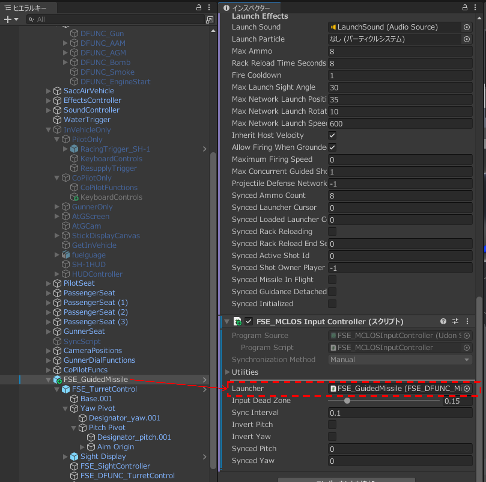
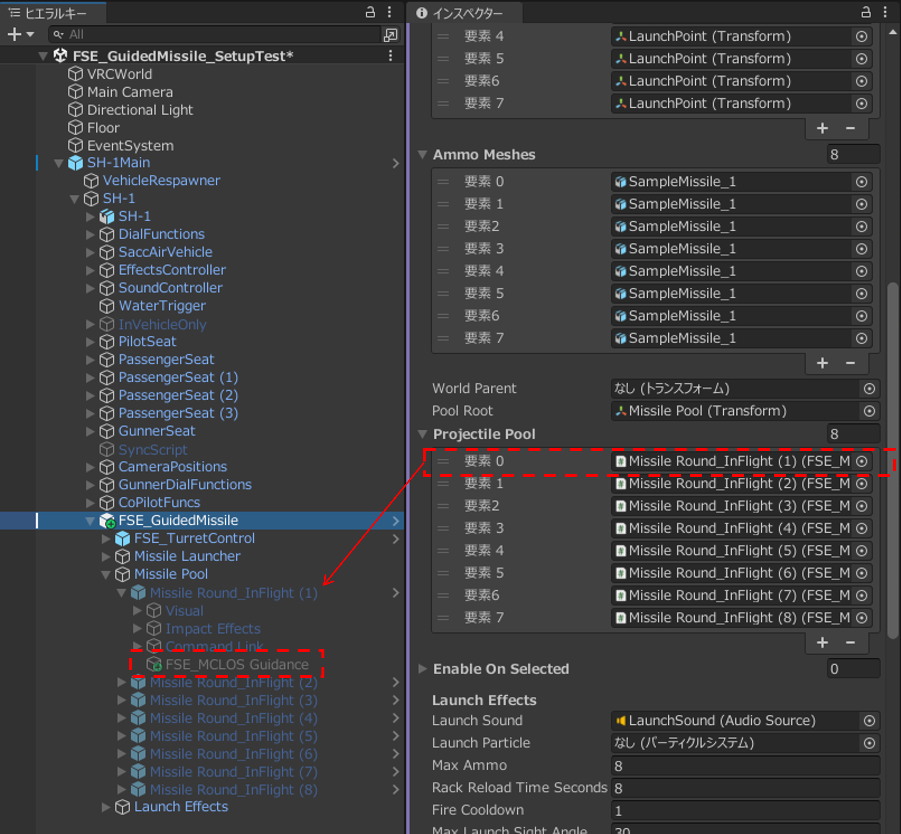
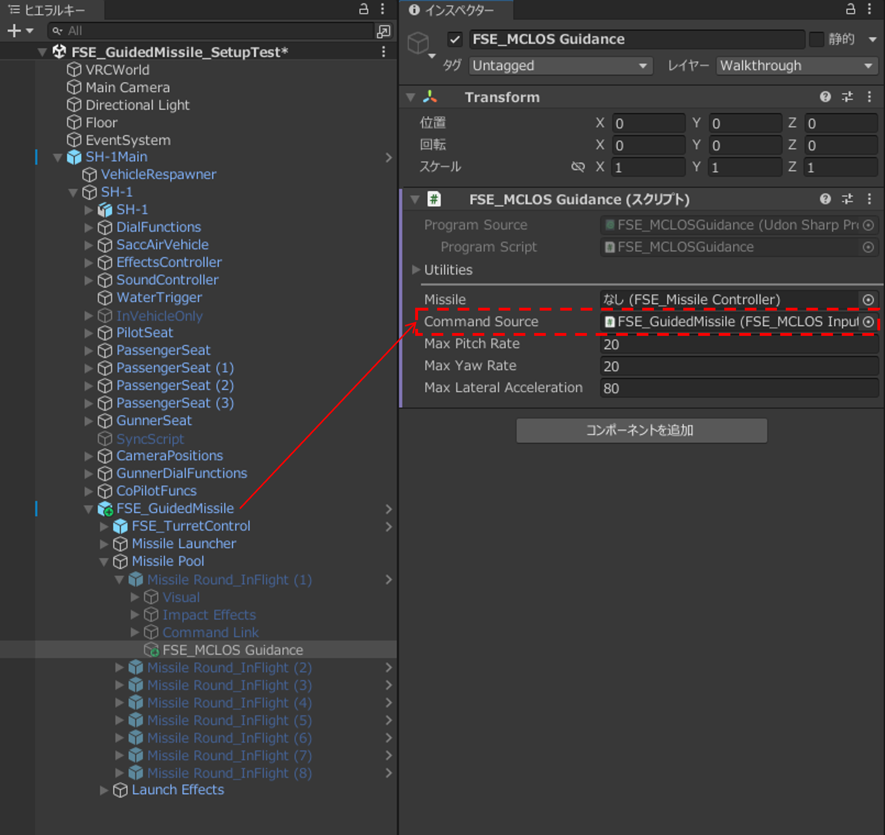
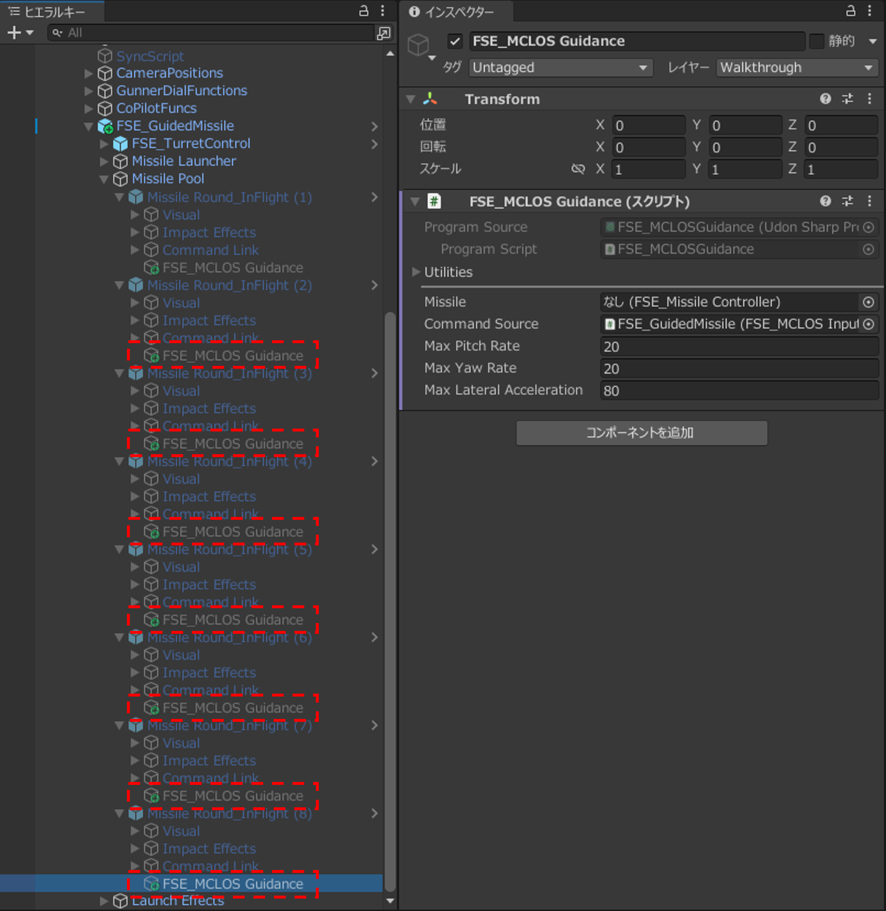
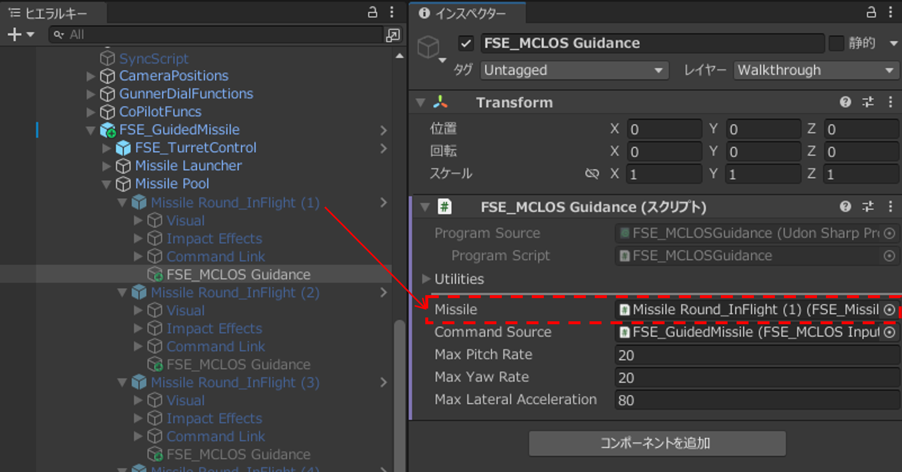
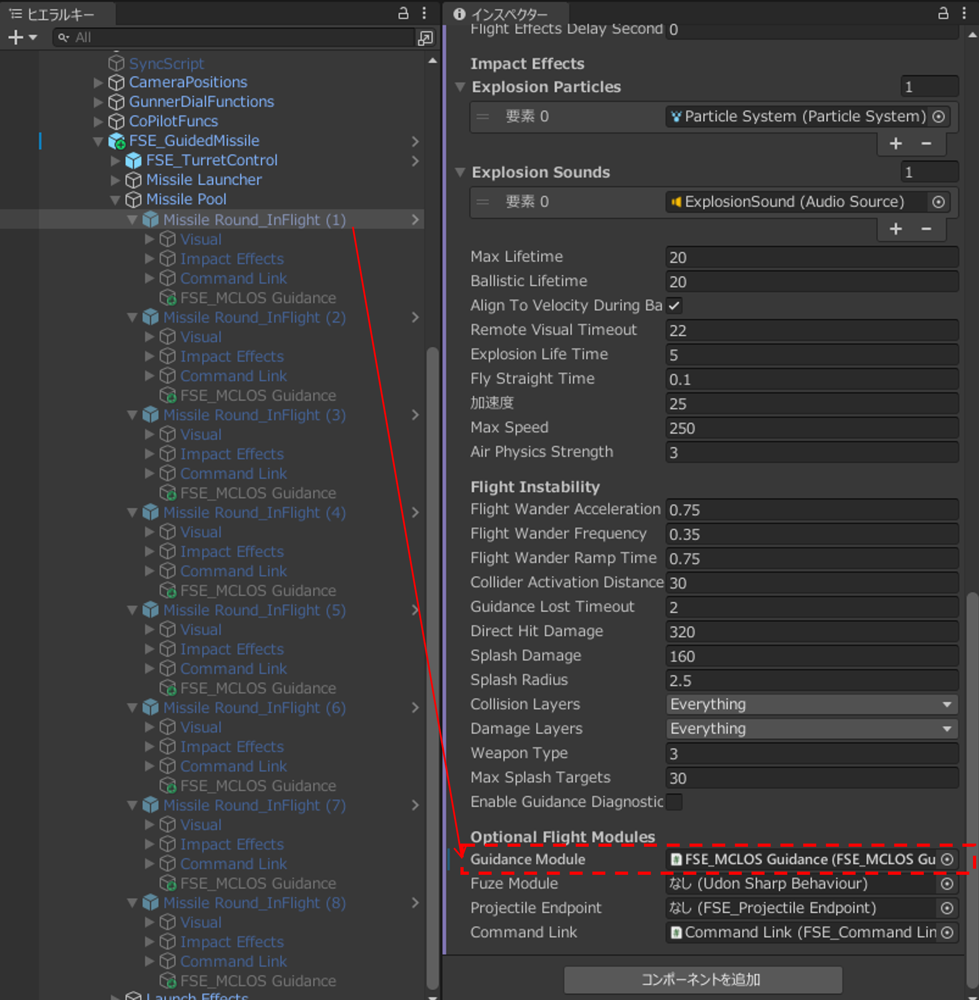

# ミサイルを手動でセットアップする

## 1. ミサイルの発射位置と搭載弾表示を調整する

`Missile Launcher`以下の`Missile Round_Stowed`の位置と回転を調整します。`Launch Point`のZ軸+（青い矢印）方向が発射方向を向くようにします。メッシュを差し替えることで任意の3Dモデルを使用することができます。

{ width="900" loading=lazy }

## 2. 照準器を乗り物へ接続する

- 誘導方式にSACLOS以外を使用する場合は、この手順は任意です。
- 誘導方式にSACLOSを使用する場合は、誘導の基準となるオブジェクトを指定する必要があります。可動する照準器（砲塔）に基準オブジェクトを配置することでミサイルを任意方向に誘導できますが、固定のオブジェクトを利用することも可能です。砲塔を使用する場合、`FSE_GuidedMissile`プレハブに付属している`FSE_TurretControl`を利用することができます（[セットアップ手順](../turret-control/installation.md)）。

## 3. 誘導方式別の導入をする

### 3-A. MCLOS方式の導入

MCLOSでは、射手が飛翔中のミサイルへ直接上下左右への旋回指令を送ります。入力を戻すと、その時点の進行方向を維持します。

#### 3-A-1. MCLOS入力を設定する

1. `FSE_GuidedMissile`へ`FSE_MCLOSInputController`を追加します。
2. 追加した`FSE_MCLOSInputController`の`Launcher`に`FSE_GuidedMissile`をドラッグアンドドロップして`FSE_DFUNC_MissileLauncher`を指定します。

    { width="900" loading=lazy }

#### 3-A-2. 各ミサイルへ誘導コンポーネントを設定する

1. `FSE_GuidedMissile`オブジェクトの`FSE_DFUNC_MissileLauncher`コンポーネントをインスペクターで開きます。`ProjectilePool`に登録された一番目のオブジェクトに空のオブジェクトを追加し、名前を`FSE_MCLOS Guidance`に変更します。

    { width="900" loading=lazy }

2. `FSE_MCLOS Guidance`オブジェクトに`FSE_MCLOS Guidance`コンポーネントを追加し、`CommandSource`へ`FSE_GuidedMissile`オブジェクト（`FSE_MCLOSInputController`）を指定します。

    { width="900" loading=lazy }

3. `FSE_MCLOS Guidance`オブジェクトを複製し、`ProjectilePool`に登録された二番目以降のオブジェクトの下に配置します。

    { width="900" loading=lazy }

4. Missile Pool以下の全てのミサイルについて、以下の設定を行います。
  
    - `FSE_MCLOS Guidance`の`Missile`に、同じミサイルの`Missile Round_InFlight`オブジェクト（`FSE_MissileController`）を指定します。

        { width="900" loading=lazy }

    - `Missile Round_InFlight`オブジェクトの`FSE_MissileController`コンポーネントの`GuidanceModule`に、同じミサイルの`FSE_MCLOSGuidance`オブジェクトを指定します。

        { width="900" loading=lazy }

### 3-B. SACLOS方式の導入

SACLOSでは、ミサイルが`GuidanceReference`の示す照準線へ自動的に旋回します。射手は飛翔中も照準を目標へ向け続けます。

#### 3-B-1. GuidanceReferenceを設定する

`FSE_GuidedMissile`オブジェクトの`GuidanceReference`に、ミサイルの誘導に使用する照準線となるオブジェクトを指定します。`FSE Turret Control`を使用する場合は、`FSE_TurretControl`内の`Aim Origin`を指定します。SACLOSは誘導に照準線を使用するため、この参照が必要です。

#### 3-B-2. 各ミサイルへ誘導コンポーネントを設定する

1. `FSE_GuidedMissile`オブジェクトの`FSE_DFUNC_MissileLauncher`コンポーネントをインスペクターで開きます。`ProjectilePool`に登録された一番目のオブジェクトに空のオブジェクトを追加し、名前を`FSE_SACLOS Guidance`に変更します。
2. `FSE_SACLOS Guidance`オブジェクトに`FSE_SACLOS Guidance`コンポーネントを追加します。
3. Missile Pool以下の全てのミサイルについて、以下の設定を行います。
  
    - `FSE_SACLOS Guidance`の`Missile`に、同じミサイルの`Missile Round_InFlight`オブジェクトを指定します。
    - `Missile Round_InFlight`オブジェクトの`FSE_MissileController`コンポーネントの`GuidanceModule`に、同じミサイルの`FSE_SACLOSGuidance`オブジェクトを指定します。
