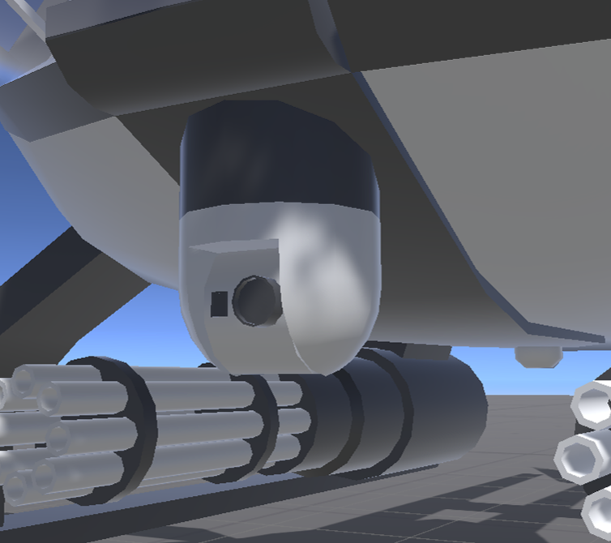

# FSE Turret Control

FSE Turret Controlは、照準器や砲塔のような1つまたは2つの回転軸を備えるタレットを操作するギミックです。

- ヨー回転軸とピッチ回転軸の両方、または片方を持つタレットのプレイヤーによる制御
- タレットの任意3Dモデルへの差し替え
- 基準タレットと同じ方向を指向する追従タレットを任意数設定可能
- HMD（VRモード）または視線（デスクトップモード）へ追従するHEAD SLAVE機能
- 照準カメラの視野角に応じた旋回速度補正

{ width="900" loading=lazy }

このギミック単独で車両の砲塔や照準カメラの制御に使用できるほか、Guided Missilesの照準器として使用できます。

## パッケージに含まれるプレハブ

`Assets\Furunin\SaccExtensions\Prefabs\Turret Control`以下にあります。

| ファイル名 | 説明 |
| --- | --- |
| `FSE_TurretControl` | 本ギミック導入用プレハブ。 |
| `Sight Display` | 照準映像の表示に使用するプレハブ。`FSE_TurretControl`に使用されます。 |

!!! Warning
    このパッケージのプレハブに変更を加える場合はプレハブを直接編集せず、プレハブバリアントを作成するかプレハブを展開して使用することを推奨します。プレハブを編集して使用すると、バージョンアップ時にギミックが正しく動作しなくなる可能性があります。

## ギミック導入手順

[導入手順](installation.md)を参照してください。
