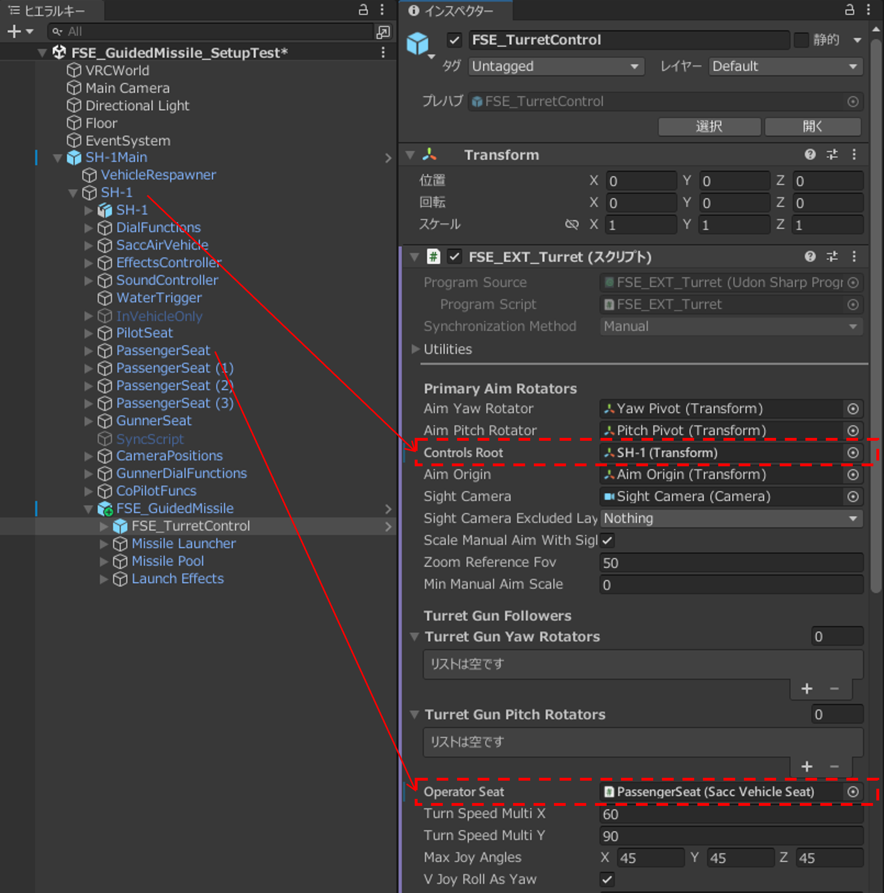
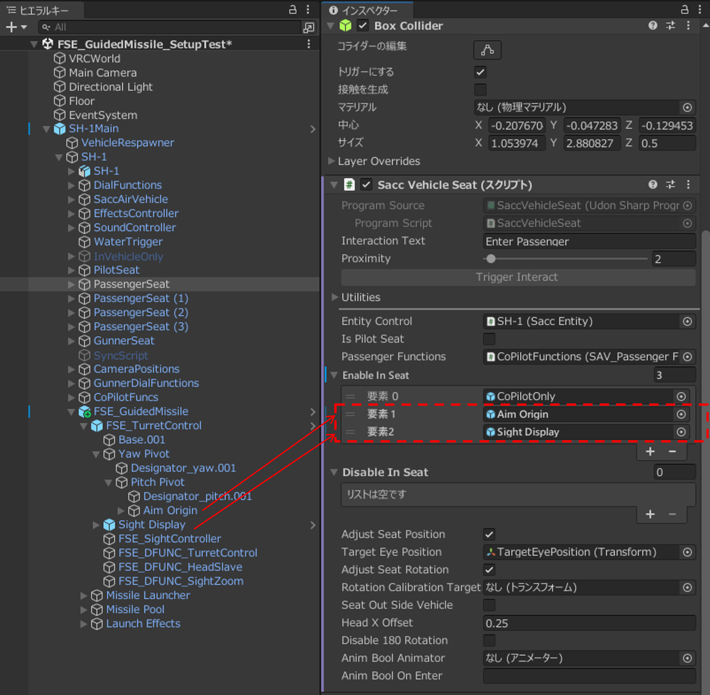
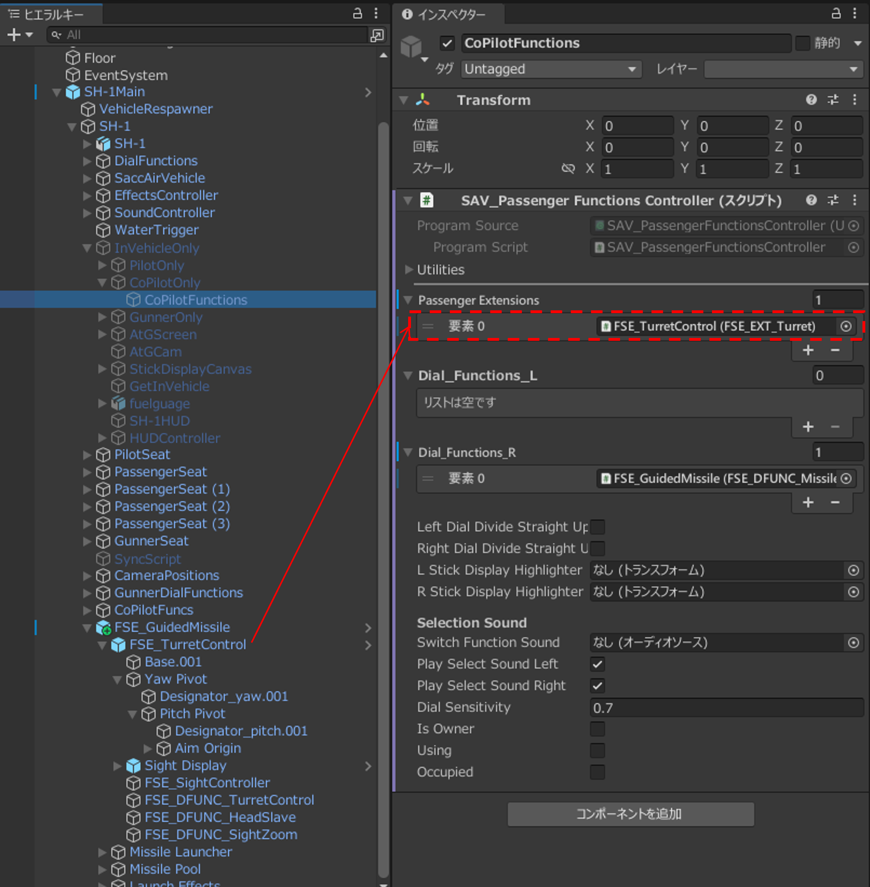
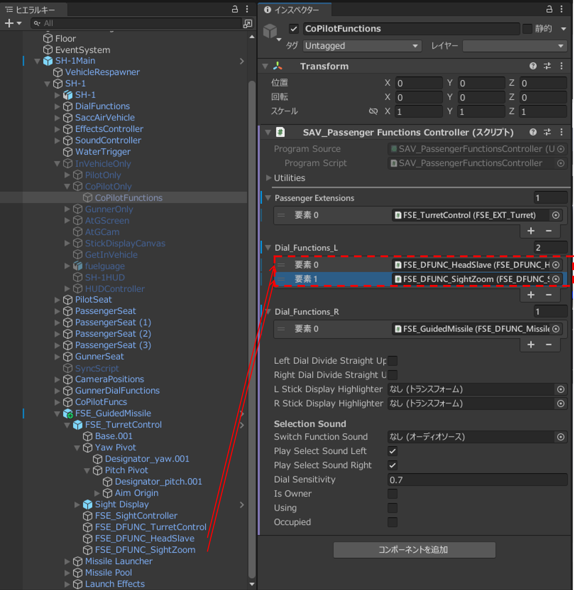
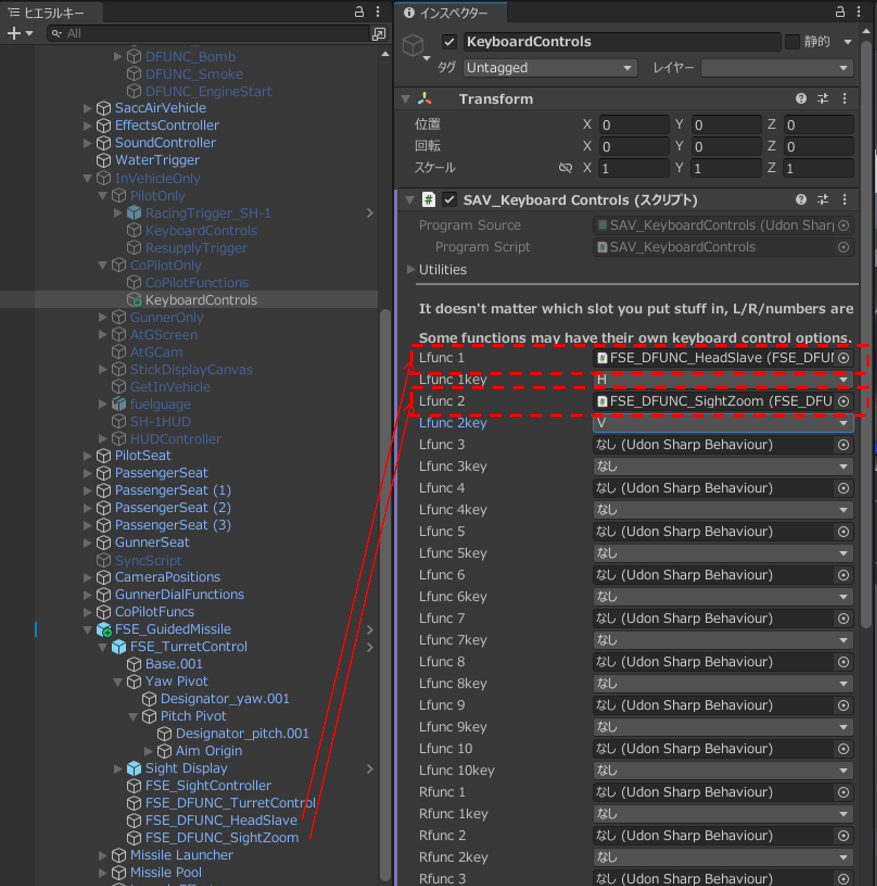

# セットアップ

## 1. FSE_TurretControl Prefabを配置する

セットアップ対象の車両ヒエラルキーに`FSE_TurretControl`がない場合は、`FSE_TurretControl`プレハブを配置します。

## 2. 参照を設定する

1. `FSE_TurretControl`オブジェクトの`FSE_EXT_Turret`に以下の設定をします。

    - `ControlsRoot`：機体回転の基準となるTransform
    - `OperatorSeat`：砲塔を操作する座席のオブジェクト

    { width="900" loading=lazy }

2. 今セットアップしている砲塔以外の砲塔やランチャー等の向きをこの砲塔へ追従させる場合は、`TurretGunYawRotators`と`TurretGunPitchRotators`へそのTransformを登録します。
3. 操作席の`Sacc Vehicle Seat`オブジェクトの`EnableInSeat`へ、以下のオブジェクトを登録します。

    - `FSE_TurretControl/Yaw Pivot/Pitch Pivot/Aim Origin`
    - `FSE_TurretControl/Sight Display`

    { width="900" loading=lazy }

## 3. 操作席の設定をする

### PassengerSeatで操作する場合

- PassengerSeatの`Sacc Vehicle Seat`内`Passenger Functions`が参照する`SAV_PassengerFunctionsController`をクリックします。インスペクターを開き、`PassengerExtensions`に`FSE_TurretControl`オブジェクト（`FSE_EXT_Turret`）を登録します。

{ width="900" loading=lazy }

### PilotSeatで操作する場合

- 車両の`SaccEntity`内`ExtensionUdonBehaviours`に`FSE_EXT_Turret`を登録します。

- 単独の砲塔として使用する場合は、`FSE_TurretControl`の子`FSE_DFUNC_TurretControl`を操作席の`Dial_Functions_L`または`Dial_Functions_R`へ登録します。

## 4. 任意機能を設定する

デスクトップモードでHEAD SLAVE、Sight Camera／Zoom機能をDialFunctionで選択できるようにするためには、割り当てた座席に対応する`KeyboardControls`でキーを設定します。`KeyboardControls`がない場合は空のオブジェクトを作成し、`SAV_KeyboardControls`コンポーネントを追加します。

### HEAD SLAVE

照準を頭または視点の向きに追従させる機能です。使用する場合は`FSE_DFUNC_HeadSlave`を操作席の`Dial_Functions_L`または`Dial_Functions_R`に登録します。

### Sight Camera／Zoom

照準映像の拡大縮小、照準による測距を行う機能です。使用する場合は`FSE_DFUNC_SightZoom`を操作席の`Dial_Functions_L`または`Dial_Functions_R`に登録します。

{ width="900" loading=lazy }

{ width="900" loading=lazy }

### Turret Follower

照準器とは別の砲塔を同じ照準方向へ向ける機能です。使用する場合は`TurretGunYawRotators`と`TurretGunPitchRotators`に砲塔のヨー回転オブジェクトとピッチ回転オブジェクトを登録します。複数の砲塔を追従させることができます。
