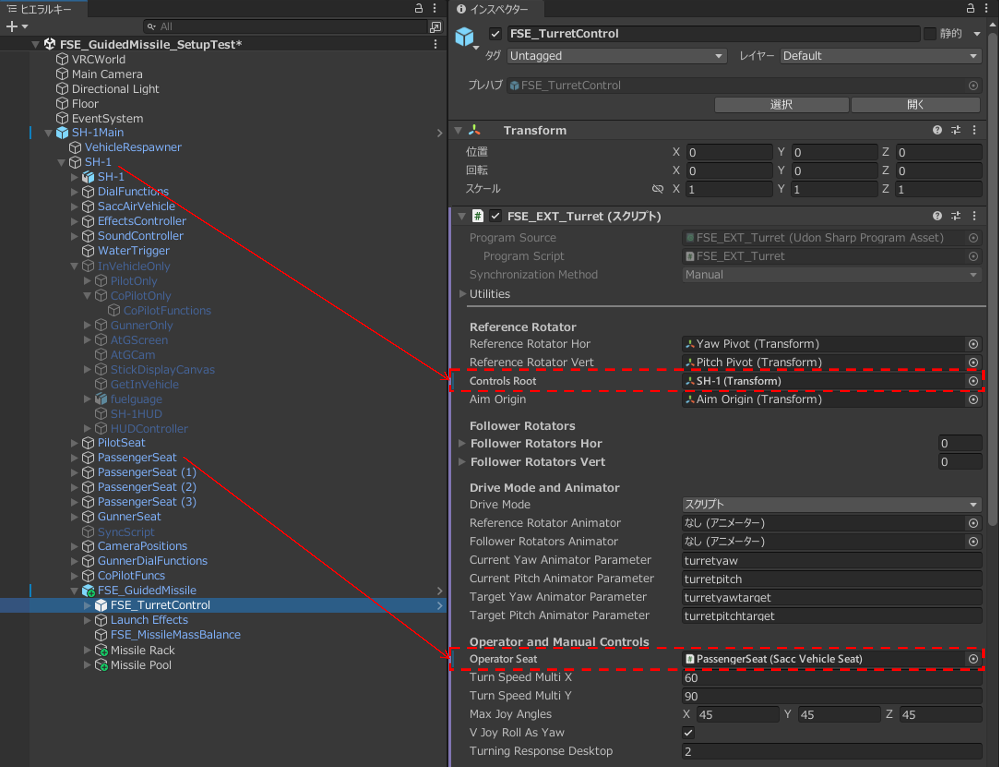
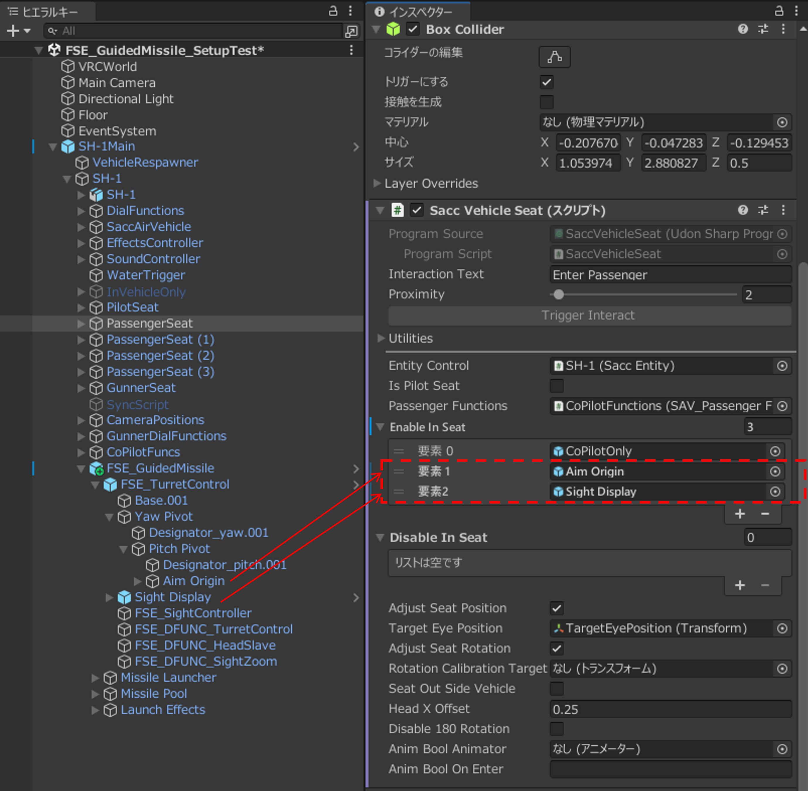
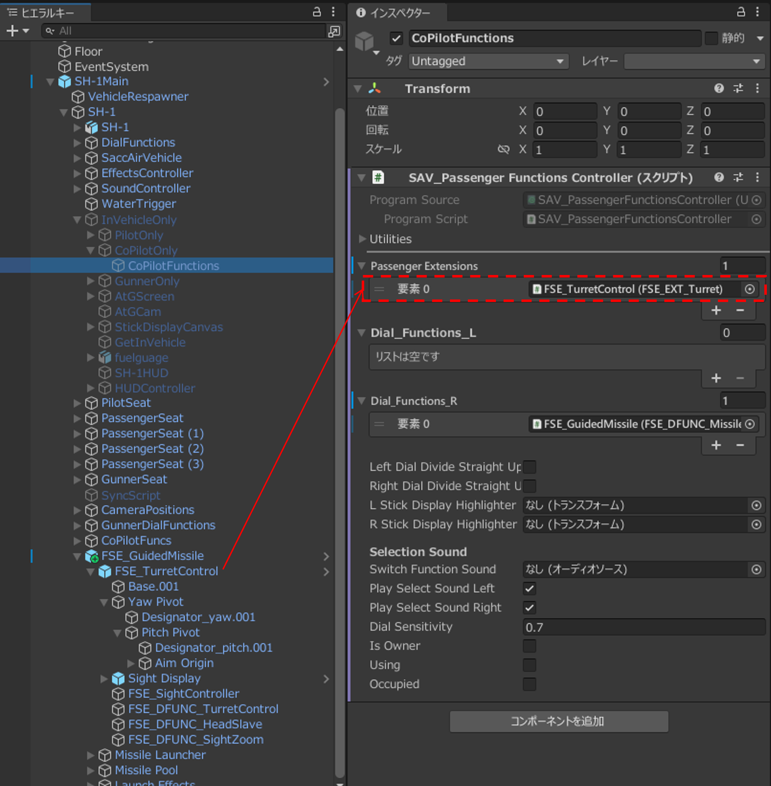
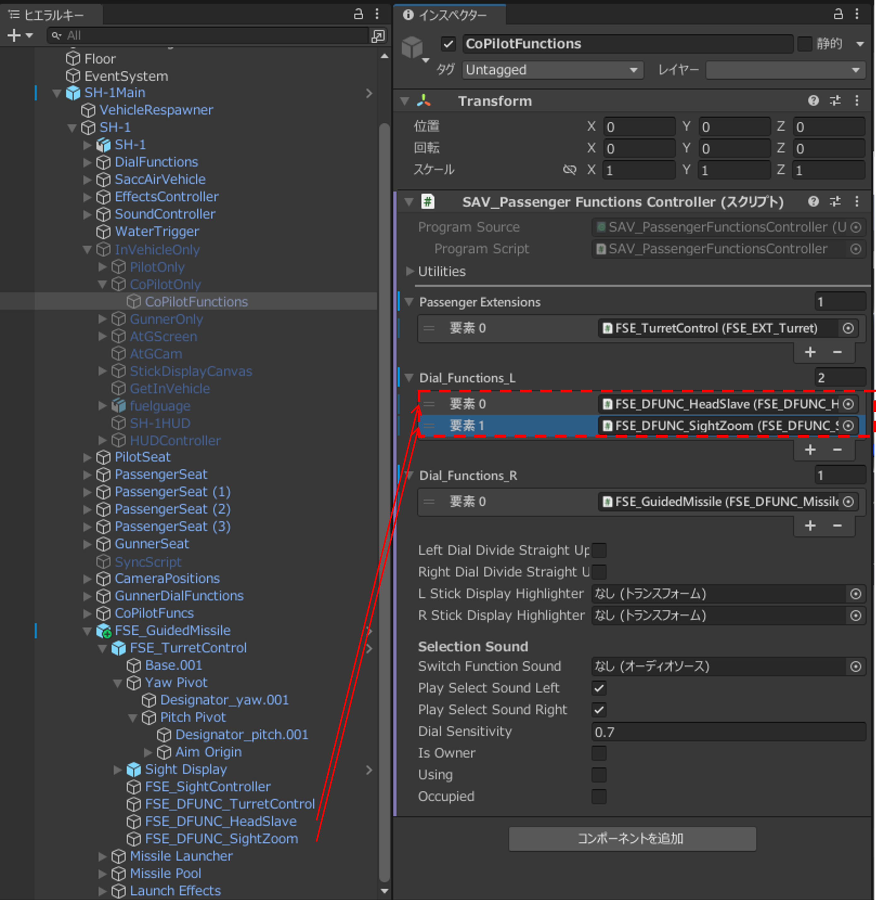
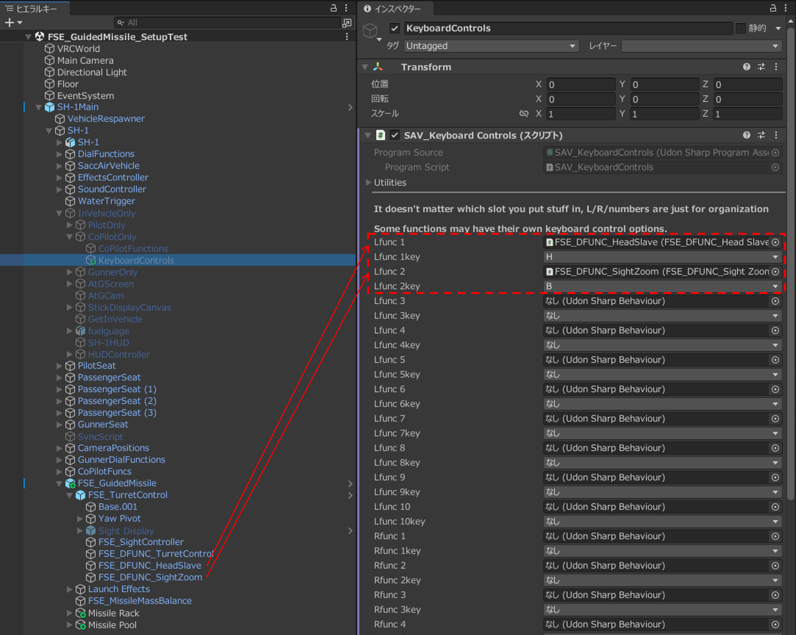

# セットアップ

## 1. FSE_TurretControl Prefabを配置する

セットアップ対象の車両ヒエラルキーに`FSE_TurretControl`がない場合は、`FSE_TurretControl`プレハブを配置します。

## 2. FSE_EXT_Turretの設定をする

### 2-1. 共通の設定をする

`FSE_TurretControl`オブジェクトの`FSE_EXT_Turret`に以下の設定をします。

| Field | 説明 |
|---|---|
| `AimYawRotator` | 基準タレットのヨー回転軸となるオブジェクトを指定します。 |
| `AimPitchRotator` | 基準タレットのピッチ回転軸となるオブジェクトを指定します。 |
| `ControlsRoot` | 対象の乗り物と共に動き、ローカルの+Z軸が車両前方を向くTransformを指定します。 |
| `OperatorSeat` | タレットを操作する座席のオブジェクトを指定します。 |

!!! note
    ヨー回転軸またはピッチ回転軸のいずれか一方しかないタレットを制御したい場合は、`AimPitchRotator`または`AimYawRotator`に何も指定しないことで設定ができます。

{ width="900" loading=lazy }

### 2-2. タレットの制御方式を選択する

タレットの旋回制御をスクリプトによって行うか、アニメーターによって行うかを選択することができます。

!!! note
    アニメーター制御モードを選択した場合は`FSE_EXT_Turret`が各回転軸の目標回転角度の算出までを行います。タレットの旋回はアニメーターが行います。

!!! note
    スクリプト制御モードを選択した場合でも、`Reference Rotator Animator`や`Follower Rotators Animator`に指定したアニメーターから各回転軸の角度に関するfloatパラメーター（`Current/Target Yaw/Pitch Animator Parameter`）を取得することができます。

#### 2-2-A. スクリプトで制御する場合

- `Drive Mode`のプルダウンから`Script`を選択します（初期値は`Script`です）。
- 追従タレットを設定する場合は、`Follower Rotators`に追加したいタレットのヨー/ピッチ回転軸を指定します。

#### 2-2-B. 自作アニメーターで制御する場合

- `Drive Mode`のプルダウンから`Animator`を選択します。
- `Reference Rotator Animator`に、基準タレットの旋回制御を設定したアニメーターを指定します。
- アニメーターで`Current/Target Yaw/Pitch Animator Parameter`で指定した名前の各回転軸の角度に関するfloatパラメーターを作成し、モデルに合わせてアニメーションを設定します。
- 追従タレットを設定する場合は、`Follower Rotators Animator`に追従タレットの旋回制御を設定したアニメーターを指定します。`Reference Rotator Animator`と同じでも構いません。

## 3. 操作席の設定をする

### 3-1. 共通の設定をする

タレットの操作席の`Sacc Vehicle Seat`オブジェクトの`EnableInSeat`へ、以下のオブジェクトを登録します。

- `FSE_TurretControl/Yaw Pivot/Pitch Pivot/Aim Origin`
- `FSE_TurretControl/Sight Display`

{ width="900" loading=lazy }

### 3-2. `FSE_EXT_Turret`を`ExtensionUdonBehaviours`に登録する

#### 3-2-A. PassengerSeatで操作する場合

- PassengerSeatの`Sacc Vehicle Seat`内`Passenger Functions`が参照する`SAV_PassengerFunctionsController`をクリックし、インスペクターを開きます。
- `PassengerExtensions`に`FSE_TurretControl`オブジェクト（`FSE_EXT_Turret`）を登録します。

{ width="900" loading=lazy }

#### 3-2-B. PilotSeatで操作する場合

- 対象の乗り物の`SaccEntity`のインスペクターを開きます。
- `ExtensionUdonBehaviours`に`FSE_TurretControl`オブジェクト（`FSE_EXT_Turret`）を登録します。
- 単独の砲塔として使用する場合は、`FSE_TurretControl`の子`FSE_DFUNC_TurretControl`を操作席の`Dial_Functions_L`または`Dial_Functions_R`へ登録します。

## 4. 任意機能を設定する

デスクトップモードでHEAD SLAVE、Sight Camera／Zoom機能をDialFunctionで選択できるようにするためには、割り当てた座席に対応する`KeyboardControls`でキーを設定します。`KeyboardControls`がない場合は空のオブジェクトを作成し、`SAV_KeyboardControls`コンポーネントを追加します。

### HEAD SLAVE

照準を頭または視点の向きに追従させる機能です。使用する場合は`FSE_DFUNC_HeadSlave`を操作席の`Dial_Functions_L`または`Dial_Functions_R`に登録します。

### Sight Camera／Zoom

照準映像の拡大縮小、照準による測距を行う機能です。使用する場合は`FSE_DFUNC_SightZoom`を操作席の`Dial_Functions_L`または`Dial_Functions_R`に登録します。

{ width="900" loading=lazy }

{ width="900" loading=lazy }
